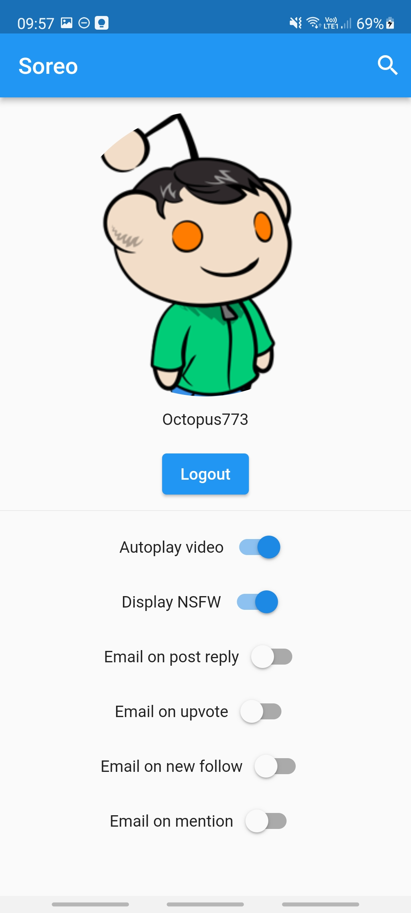
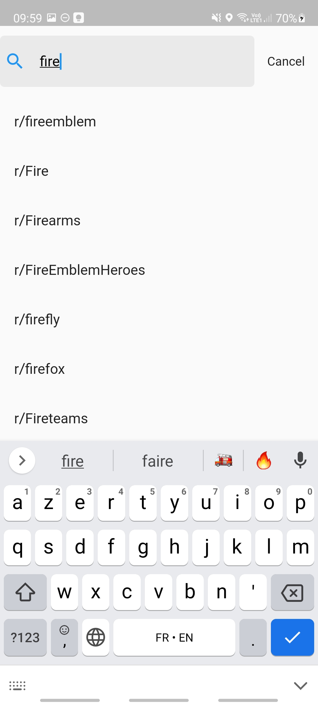
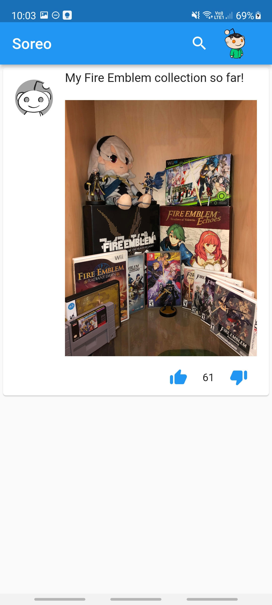

  
  

# Soreo

Soreo is a modern Reddit client, with an minimalist UI

## Screenshots
Post list

Profile view

Search view

Subreddit view

Post view

## Documentation

[Technical Documentation](https://octopus773.github.io/Soreo/)

## Tech Stack

Dart (Flutter), BLoC, Material UI

## Authors

- [@Zoe Roux](https://www.github.com/AnonymusRaccoon)
- [@Clément Le Bihan](https://www.github.com/Octopus773)
